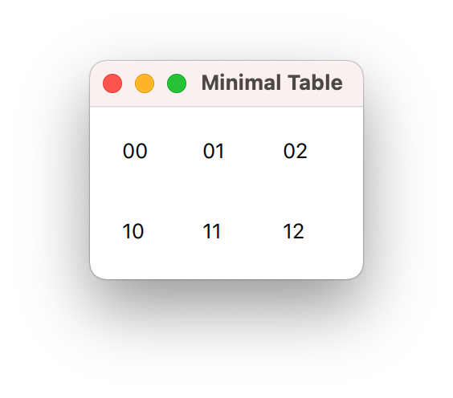
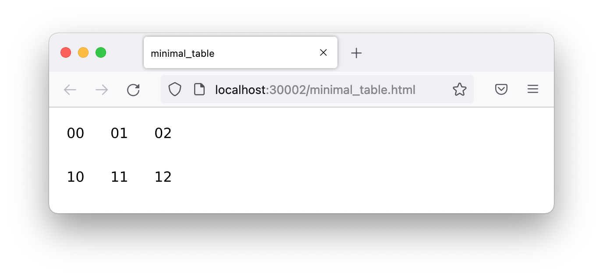

# Minimal Table

A very simple QML table view displays data from a small, fixed, C++ table model.


## Description

The first exercise is most basic. It focuses on discovering the tools and build details for a simple, tested, application that runs on the desktop and in a browser. The configuration is described in the parent document.

A C++ data model provides one code complication. It demonstrates that data models used with QtWidgets views may be re-used with QML/Quick views.


## Tests

A google-test suite defines the small, fixed, C++ data model.

```
[==========] Running 4 tests from 1 test suite.
[----------] Global test environment set-up.
[----------] 4 tests from MinimalTableModelTest
[ RUN      ] MinimalTableModelTest.hasTwoRows
[       OK ] MinimalTableModelTest.hasTwoRows (0 ms)
[ RUN      ] MinimalTableModelTest.hasThreeColumns
[       OK ] MinimalTableModelTest.hasThreeColumns (0 ms)
[ RUN      ] MinimalTableModelTest.displays00StringInTopLeftCell
[       OK ] MinimalTableModelTest.displays00StringInTopLeftCell (0 ms)
[ RUN      ] MinimalTableModelTest.displays12StringInBottomRightCell
[       OK ] MinimalTableModelTest.displays12StringInBottomRightCell (0 ms)
[----------] 4 tests from MinimalTableModelTest (0 ms total)

[----------] Global test environment tear-down
[==========] 4 tests from 1 test suite ran. (0 ms total)
[  PASSED  ] 4 tests.
```


## Desktop Application




## Browser Application

The code complication means that this application does **not** run in [Qt Design Viewer][01], an otherwise convenient tool for previewing pure QML projects in a browser -- the C++ data model makes this a non-pure QML project.

[01]: https://qt-webassembly.io/designviewer/
      "Qt Design Viewer, powered by web assembly"

A full Emscripten/WebAssembly build **does** run in a browser.



