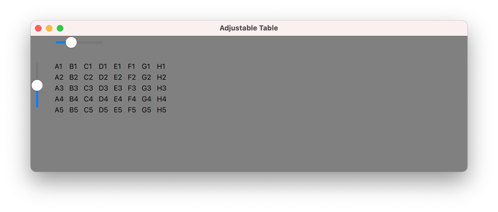
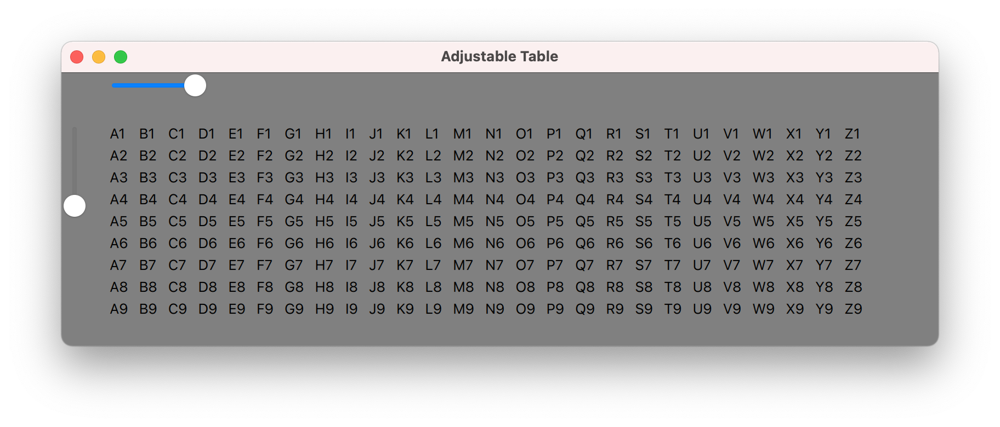
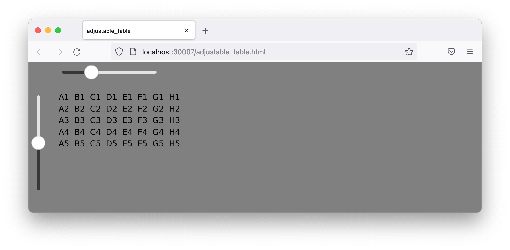
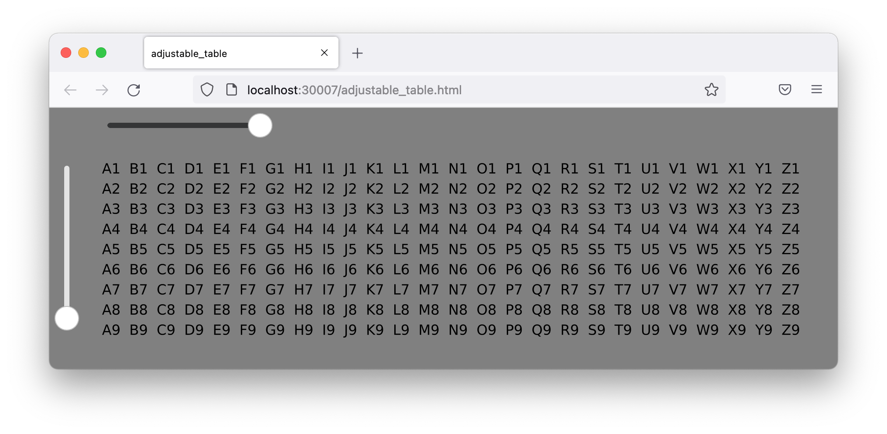

# Adjustable Table

A QML table view displays data from a C++ table model, with controls for the number of rows and columns.

## Description

The second exercise has a C++ table data model with configurable dimensions, exposed to QML via Qt's Property System.

The QML code describes the table view, with slider controls for the row and column dimensions. It connects the item properties, enabling the model/view interactions.

## Tests

A google-test suite defines the variability of the adjustable table model dimensions.

```
[==========] Running 9 tests from 1 test suite.
[----------] Global test environment set-up.
[----------] 9 tests from AdjustableTableModel
[ RUN      ] AdjustableTableModel.hasMaximumDimensions
[       OK ] AdjustableTableModel.hasMaximumDimensions (0 ms)
[ RUN      ] AdjustableTableModel.hasDefaultDimensions
[       OK ] AdjustableTableModel.hasDefaultDimensions (0 ms)
[ RUN      ] AdjustableTableModel.enforcesMinimumNumberOfRows
[       OK ] AdjustableTableModel.enforcesMinimumNumberOfRows (0 ms)
[ RUN      ] AdjustableTableModel.enforcesMaximumNumberOfRows
[       OK ] AdjustableTableModel.enforcesMaximumNumberOfRows (0 ms)
[ RUN      ] AdjustableTableModel.enforcesMinimumNumberOfColumns
[       OK ] AdjustableTableModel.enforcesMinimumNumberOfColumns (0 ms)
[ RUN      ] AdjustableTableModel.enforcesMaximumNumberOfColumns
[       OK ] AdjustableTableModel.enforcesMaximumNumberOfColumns (0 ms)
[ RUN      ] AdjustableTableModel.displaysHeaderRowNumbers
[       OK ] AdjustableTableModel.displaysHeaderRowNumbers (0 ms)
[ RUN      ] AdjustableTableModel.displaysHeaderColumnLetters
[       OK ] AdjustableTableModel.displaysHeaderColumnLetters (0 ms)
[ RUN      ] AdjustableTableModel.displaysDataAsColumnHeaderPlusRowHeader
[       OK ] AdjustableTableModel.displaysDataAsColumnHeaderPlusRowHeader (0 ms)
[----------] 9 tests from AdjustableTableModel (0 ms total)

[----------] Global test environment tear-down
[==========] 9 tests from 1 test suite ran. (0 ms total)
[  PASSED  ] 9 tests.
```

## Desktop Application




## Browser Application



