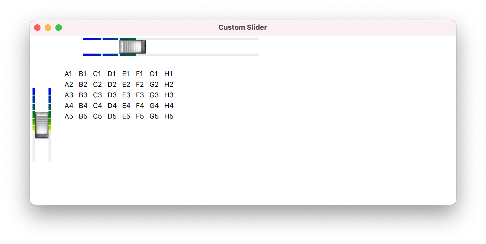
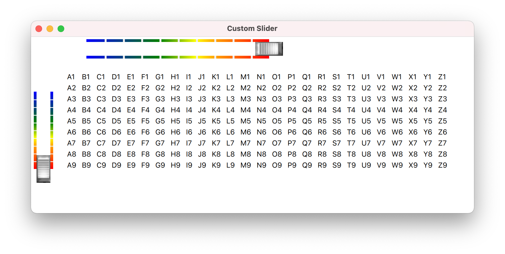
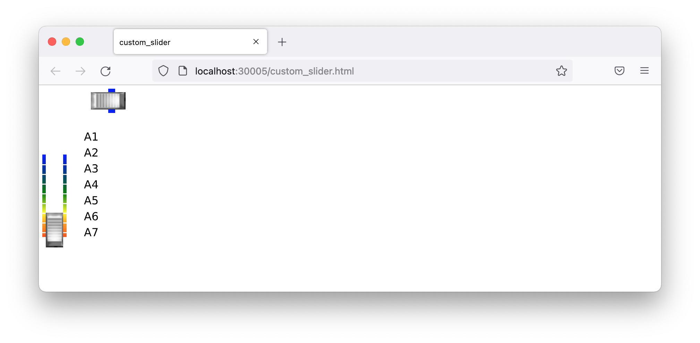
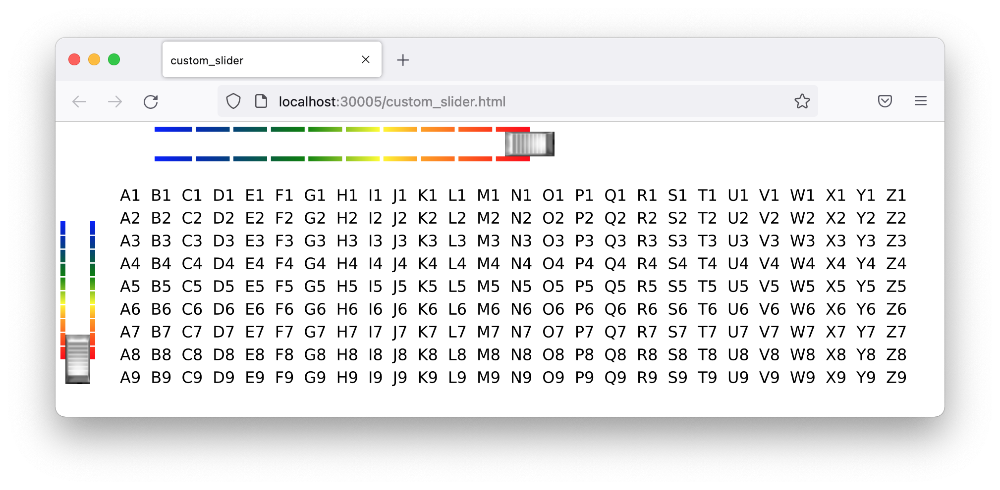

# Custom Slider

A custom QML slider control.

## Description

The third exercise builds on the adjustable table exercise, replacing the standard QML slider control with a custom slider.

The custom slider started life as a copy of Qt's BasicSlider.qml, and then the tinkering began, replacing the handle with images, adding color annotation, and getting the layout details right.

The custom slider is a drop-in replacement for the standard slider.

## Tests

The same google-test suite from exercise two defines the variability of the adjustable table model dimensions.

```
[==========] Running 9 tests from 1 test suite.
[----------] Global test environment set-up.
[----------] 9 tests from AdjustableTableModel
[ RUN      ] AdjustableTableModel.hasMaximumDimensions
[       OK ] AdjustableTableModel.hasMaximumDimensions (0 ms)
[ RUN      ] AdjustableTableModel.hasDefaultDimensions
[       OK ] AdjustableTableModel.hasDefaultDimensions (0 ms)
[ RUN      ] AdjustableTableModel.enforcesMinimumNumberOfRows
[       OK ] AdjustableTableModel.enforcesMinimumNumberOfRows (0 ms)
[ RUN      ] AdjustableTableModel.enforcesMaximumNumberOfRows
[       OK ] AdjustableTableModel.enforcesMaximumNumberOfRows (0 ms)
[ RUN      ] AdjustableTableModel.enforcesMinimumNumberOfColumns
[       OK ] AdjustableTableModel.enforcesMinimumNumberOfColumns (0 ms)
[ RUN      ] AdjustableTableModel.enforcesMaximumNumberOfColumns
[       OK ] AdjustableTableModel.enforcesMaximumNumberOfColumns (0 ms)
[ RUN      ] AdjustableTableModel.displaysHeaderRowNumbers
[       OK ] AdjustableTableModel.displaysHeaderRowNumbers (0 ms)
[ RUN      ] AdjustableTableModel.displaysHeaderColumnLetters
[       OK ] AdjustableTableModel.displaysHeaderColumnLetters (0 ms)
[ RUN      ] AdjustableTableModel.displaysDataAsColumnHeaderPlusRowHeader
[       OK ] AdjustableTableModel.displaysDataAsColumnHeaderPlusRowHeader (0 ms)
[----------] 9 tests from AdjustableTableModel (0 ms total)

[----------] Global test environment tear-down
[==========] 9 tests from 1 test suite ran. (0 ms total)
[  PASSED  ] 9 tests.
```

## Desktop Application




## Browser Application



