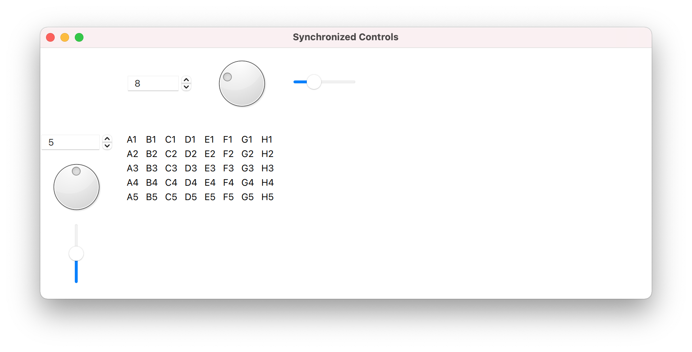
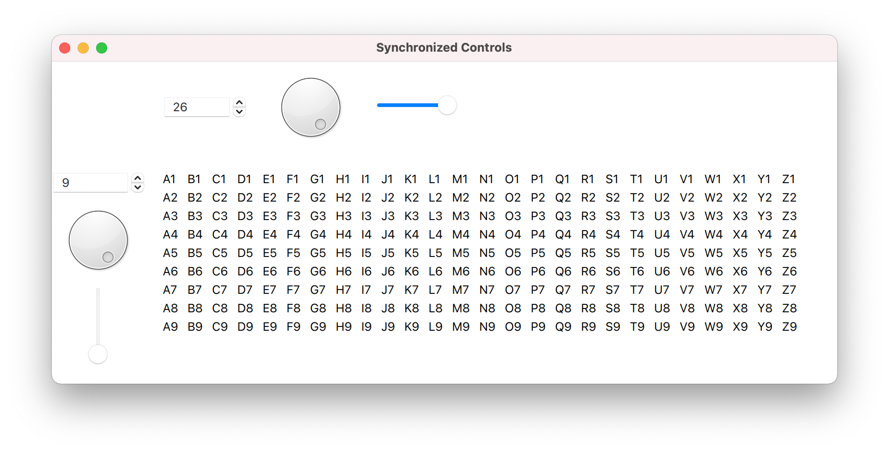
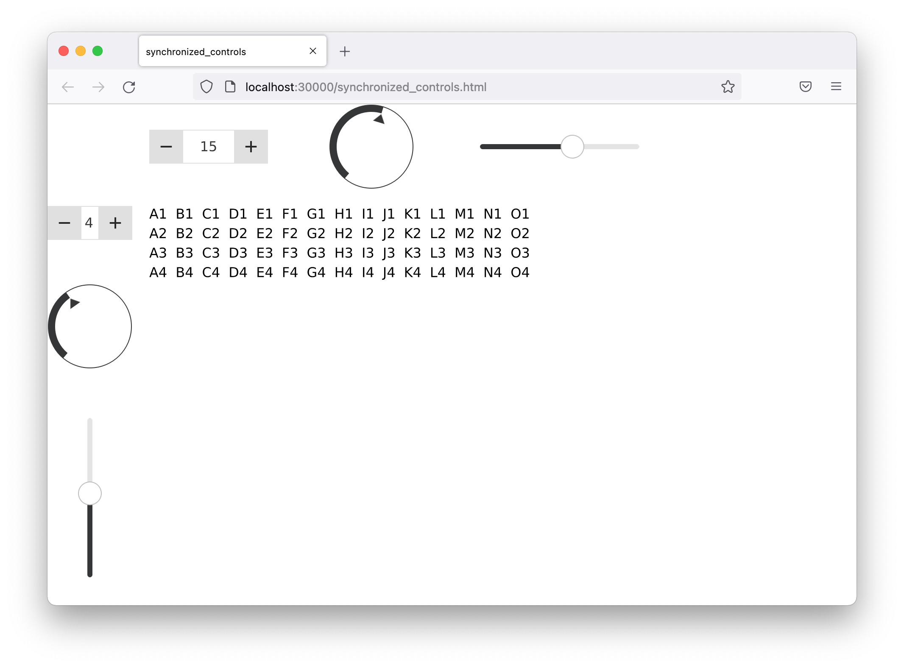
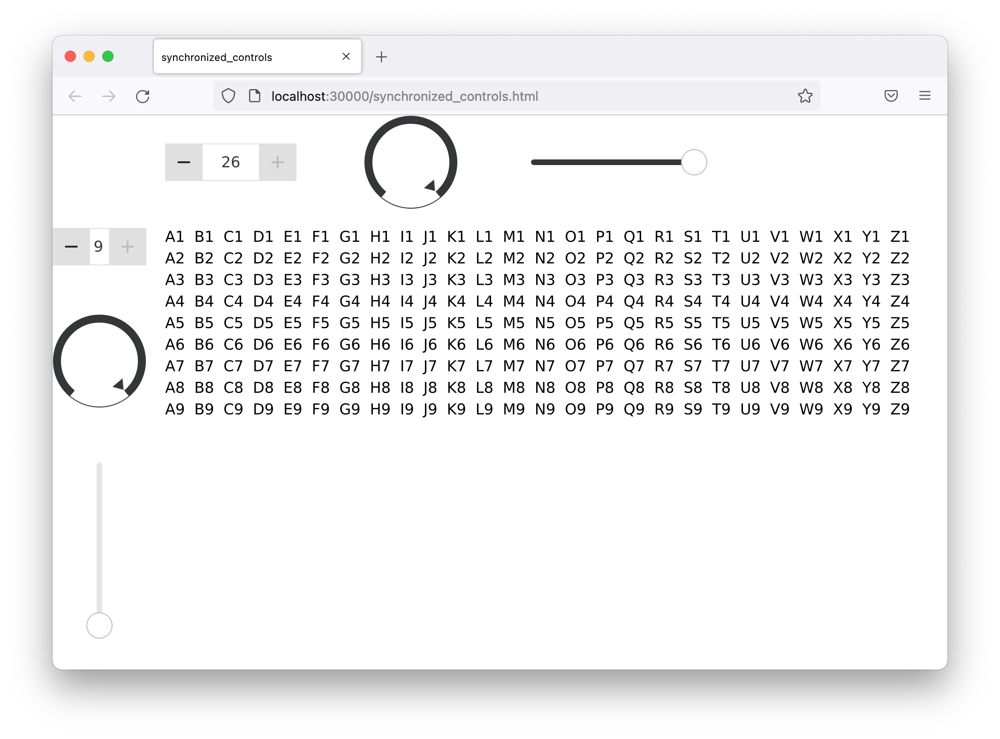

# Synchronized Controls

Multiple, synchronized controls for the adjustable table.


## Description

Builds on the adjustable table exercise, adding more controls for the table dimensions.

GUIs often have multiple, synchronized controls for the same function, requiring common properties, rather than direct bindings between items.


## Implementation Highlights

In AdjustableTable.qml

- Synchronizing many items suggests the item's nRows/nCols properties
- The six controls and the table depend on one or both properties
  - When a property changes all its dependencies update
- The dependencies are uni-directional
  - To complete the synchronization, each control actively updates the corresponding property when its value changes


## Tests

The same google-test suite from a previous exercise defines the variability of the adjustable table model dimensions.

```
[==========] Running 9 tests from 1 test suite.
[----------] Global test environment set-up.
[----------] 9 tests from AdjustableTableModelTest
[ RUN      ] AdjustableTableModelTest.hasMaximumDimensions
[       OK ] AdjustableTableModelTest.hasMaximumDimensions (0 ms)
[ RUN      ] AdjustableTableModelTest.hasDefaultDimensions
[       OK ] AdjustableTableModelTest.hasDefaultDimensions (0 ms)
[ RUN      ] AdjustableTableModelTest.enforcesMinimumNumberOfRows
[       OK ] AdjustableTableModelTest.enforcesMinimumNumberOfRows (0 ms)
[ RUN      ] AdjustableTableModelTest.enforcesMaximumNumberOfRows
[       OK ] AdjustableTableModelTest.enforcesMaximumNumberOfRows (0 ms)
[ RUN      ] AdjustableTableModelTest.enforcesMinimumNumberOfColumns
[       OK ] AdjustableTableModelTest.enforcesMinimumNumberOfColumns (0 ms)
[ RUN      ] AdjustableTableModelTest.enforcesMaximumNumberOfColumns
[       OK ] AdjustableTableModelTest.enforcesMaximumNumberOfColumns (0 ms)
[ RUN      ] AdjustableTableModelTest.displaysHeaderRowNumbers
[       OK ] AdjustableTableModelTest.displaysHeaderRowNumbers (0 ms)
[ RUN      ] AdjustableTableModelTest.displaysHeaderColumnLetters
[       OK ] AdjustableTableModelTest.displaysHeaderColumnLetters (0 ms)
[ RUN      ] AdjustableTableModelTest.displaysDataAsColumnHeaderPlusRowHeader
[       OK ] AdjustableTableModelTest.displaysDataAsColumnHeaderPlusRowHeader (0 ms)
[----------] 9 tests from AdjustableTableModelTest (0 ms total)

[----------] Global test environment tear-down
[==========] 9 tests from 1 test suite ran. (0 ms total)
[  PASSED  ] 9 tests.
```


## Desktop Application





## Browser Application


