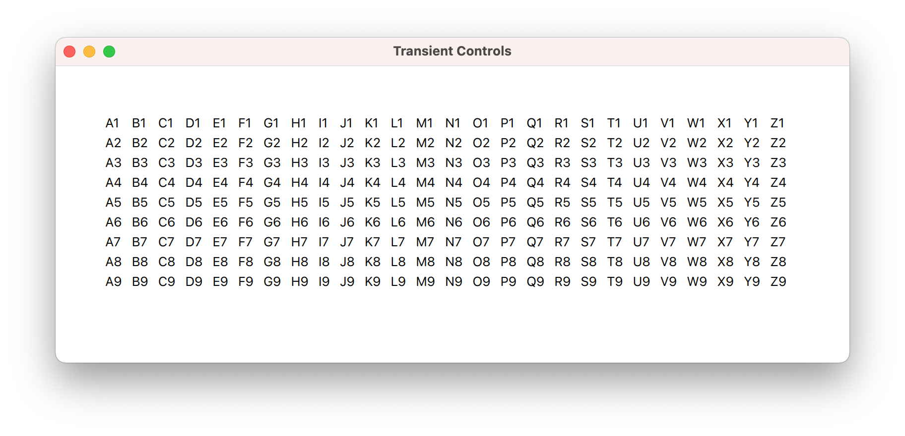
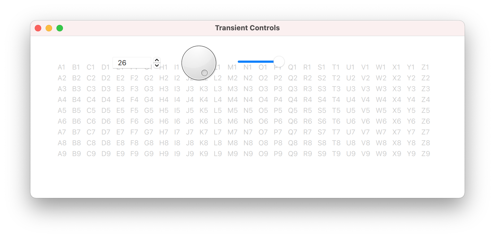
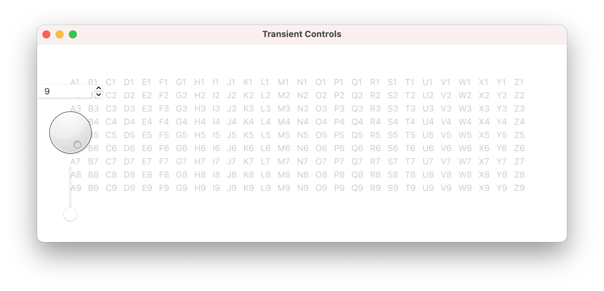

# Transient Controls

Controls for the adjustable table that appear when needed, and then disappear.


## Description

Builds on the synchronized controls exercise, smoothly showing the controls when the pointer is nearby, and hiding them when not needed.

After learning some basics in the previous exercises, this gets to QML's strength -- fluid, animated GUIs that would be strange and difficult in a QtWidgets environment.


## Implementation Highlights

In AdjustableTable.qml

- Remove the grid layout from the previous exercise to focus on the table
- Add mouse areas to detect the pointer near the controls
  - Set hoverEnabled to detect mouse motion without a click
  - Accept no buttons so the underlying controls get them
- Make the TableView interactive:false so it does not steal the control input
- Show/hide the controls with a scale animation
- Dim/brighten the table with an opacity animation


## Tests

The same google-test suite from a previous exercise defines the variability of the adjustable table model dimensions.

```
[==========] Running 9 tests from 1 test suite.
[----------] Global test environment set-up.
[----------] 9 tests from AdjustableTableModelTest
[ RUN      ] AdjustableTableModelTest.hasMaximumDimensions
[       OK ] AdjustableTableModelTest.hasMaximumDimensions (0 ms)
[ RUN      ] AdjustableTableModelTest.hasDefaultDimensions
[       OK ] AdjustableTableModelTest.hasDefaultDimensions (0 ms)
[ RUN      ] AdjustableTableModelTest.enforcesMinimumNumberOfRows
[       OK ] AdjustableTableModelTest.enforcesMinimumNumberOfRows (0 ms)
[ RUN      ] AdjustableTableModelTest.enforcesMaximumNumberOfRows
[       OK ] AdjustableTableModelTest.enforcesMaximumNumberOfRows (0 ms)
[ RUN      ] AdjustableTableModelTest.enforcesMinimumNumberOfColumns
[       OK ] AdjustableTableModelTest.enforcesMinimumNumberOfColumns (0 ms)
[ RUN      ] AdjustableTableModelTest.enforcesMaximumNumberOfColumns
[       OK ] AdjustableTableModelTest.enforcesMaximumNumberOfColumns (0 ms)
[ RUN      ] AdjustableTableModelTest.displaysHeaderRowNumbers
[       OK ] AdjustableTableModelTest.displaysHeaderRowNumbers (0 ms)
[ RUN      ] AdjustableTableModelTest.displaysHeaderColumnLetters
[       OK ] AdjustableTableModelTest.displaysHeaderColumnLetters (0 ms)
[ RUN      ] AdjustableTableModelTest.displaysDataAsColumnHeaderPlusRowHeader
[       OK ] AdjustableTableModelTest.displaysDataAsColumnHeaderPlusRowHeader (0 ms)
[----------] 9 tests from AdjustableTableModelTest (0 ms total)

[----------] Global test environment tear-down
[==========] 9 tests from 1 test suite ran. (0 ms total)
[  PASSED  ] 9 tests.
```


## Desktop Application




